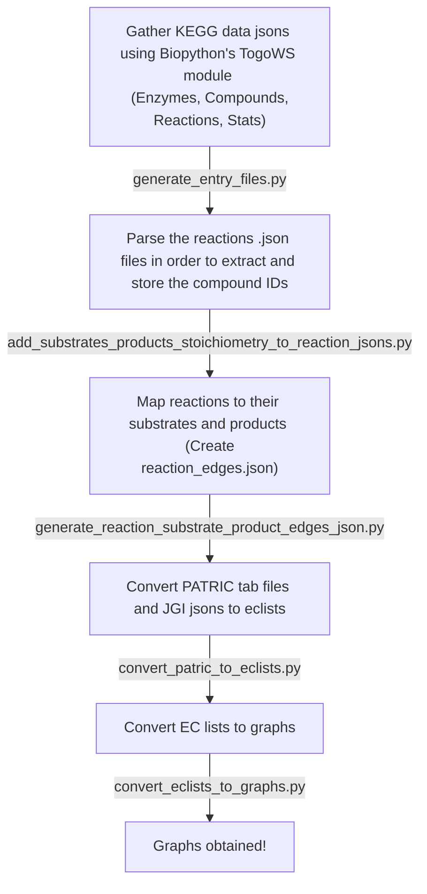

# Outdated

#### Recommended workflow



#### To pull PATRIC data (bacteria and archaea):

PATRIC has been updated so that you no longer need to FTP in order to grab the information we want (EC numbers). Data can be pulled from the **GUI** (only works to pull <10k genomes at a time) or the **command line** (no limit on number of genomes pulled).

##### GUI 


1. Visit  https://www.patricbrc.org/


2. Click on the Organisms tab &rarr; All bacteria or All archaea


3. Click on the Genomes tab


4. Click on the box to select all genomes (you will get a warning if the database you're in has more than 10k genomes to select, and will be limited to 10k. I recommend selecting even less though, because sometimes even at the limit of 10k your download request will be denied).


5. Click on the green DWNLD button.


6. Click on More Options.


7. Check the "Pathway assignments in tab-delimited format (*.pathway.tab)" box. Click the Download button.

Summary: Genomes tab-> click the box to select all genomes -> hit the "DWNLD" button in green (NOT the one above the box) -> select "more options" -> check the "Pathway assignments in tab-delimited format" box, and download.

##### Command Line Interface

- PATRIC also have a command line interface available, which seems like the best alternative to FTP if you know which data you're after. Information is here: http://docs.patricbrc.org/cli_tutorial/cli_getting_started.html

#### To pull JGI (eukarya and metagenomes):

#####Eukarya

Run `scrape_eukarya_from_jgi` to pull a json for each eukaryote in the JGI database.

######Usage

 `scrape_eukarya_from_jgi.py SAVE_DIR`
 ` scrape_eukarya_from_jgi.py SAVE_DIR [--database=<db>]`
 ` scrape_eukarya_from_jgi.py SAVE_DIR [--homepage=<hp>]`
 `scrape_eukarya_from_jgi.py SAVE_DIR [--write_concatenated_json=<wj>]`

######Arguments

  `SAVE_DIR`  directory to write jsons to (no \ required after name)

######Options

 ` --database=<db>`    Database to use, either `jgi` or `all` [default: `jgi`]

 ` --homepage=<hp>`    url of jgi homepage [default: `https://img.jgi.doe.gov/cgi-bin/m/main.cgi`]

 ` --write_concatenated_json=<wj> `    write single concatenated json after all individual jsons are written [default: `True`]

jsons

######Output

The json has two outer level keys:

`genome` &rarr; list of `[<ECs>]` &rarr; list of `[<EC name>, <count of EC>]`

`metadata` &rarr; dict of `{<metadata_key>: <value>}`

Accessing genome data:

````python
In [1]: for outer_key in genome1:
   ...:     print outer_key
   ...:     
'genome'
'metadata'
````

```python
In [2]: for ec in genome1['genome']:
   ...:     print ec
   ...:     
'EC:1.3.1.42'
'EC:1.13.11.27'
'EC:2.4.1.259'
'EC:6.3.4.14'
'EC:5.4.99.7'
```

```python
In [3]: genome1['genome']['EC:5.4.99.7']
Out[3]: [u'Lanosterol synthase.', u'1']
```

Accessing genome metadata:

```python
In [4]: genome1['metadata']
Out[4]: 
{u'\nGOLD Analysis Project Id': u'\nGa0029796',
 u'\nGOLD ID in IMG Database': u'\nStudy ID: Gs0019660\xa0\xa0Project ID: Gp0017786',
 u' Add Date': u'\n2007-06-25',
 u' Distance Matrix Calc. Date': u'\n2017-06-18',
 u' High Quality': u'\nYes',
 u' Modified Date': u'\n2014-08-05',
 u' Release Date': u'\n2007-09-01',
 u'Bioproject Accession': u'PRJNA16843',
 u'Biosample Accession': u'SAMN02746101',
 u'Comment': u'',
 u'Culture Type': u'Isolate',
 u'Cultured': u'Yes',
 u'Ecosystem': u'Host-associated',
 u'Ecosystem Category': u'Insecta',
 u'Ecosystem Subtype': u'Unclassified',
 u'Ecosystem Type': u'Unclassified',
 u'External Links': u'',
 u'GOLD Analysis Project Type': u'Genome Analysis',
 u'GOLD Sequencing Quality': u'Level 1: Standard Draft',
 u'GOLD Sequencing Strategy': u'Whole Genome Sequencing',
 u'GPTS Proposal Id': u'3041',
 u'Genome Completeness %': u'',
 u'Habitat': u'Host',
 u'IMG Release': u'IMG/W 2.3',
 u'Is Public': u'Yes',
 u'Isolation': u'Insect larvae',
 u'JGI Analysis Project Type': u'Genome Analysis',
 u'Lineage': u'Eukaryota; Ascomycota; Saccharomycetes; Saccharomycetales; Debaryomycetaceae; Scheffersomyces; Scheffersomyces stipitis',
 u'Metabolism': u'Prototrophic (L-methionine synthesis with methanethiol) (IMG_PIPELINE; 2015-10-06)',
 u'NCBI Taxon ID': u'322104',
 u'Organism Name': u'Scheffersomyces stipitis CBS 6054',
 u'PMO ID': u'16275',
 u'Relevance': u'Biotechnological, Energy production, Ethanol production, Fermentation',
 u'Seq Status': u'Complete',
 u'Sequencing Center': u'DOE Joint Genome Institute (JGI)',
 u'Sequencing Status': u'Permanent Draft',
 u'Specific Ecosystem': u'Unclassified',
 u'Study Name (Proposal Name)': u'Pichia stipitis',
 u'Submission Type': u'Primary',
 u'Taxon ID': u'640281010',
 u'Temperature Range': u'Mesophile',
 u'Type Strain': u'Unknown'}
```

Other genomes may have more fields or less fields. Check JGI at time of scraping to identify the valid metadata fields.

##### Metagenomes

Run `scrape_metagenomes_from_jgi` to pull a json for each metagenome in the JGI database.

######Usage

  `scrape_metagenomes_from_jgi.py SAVE_DIR`
  `scrape_metagenomes_from_jgi.py SAVE_DIR [--database=<db>]`
  `scrape_metagenomes_from_jgi.py SAVE_DIR [--homepage=<hp>]`
  `scrape_metagenomes_from_jgi.py SAVE_DIR [--write_concatenated_json=<wj>]`
  `scrape_metagenomes_from_jgi.py SAVE_DIR [--ecosystem_classes=<ec>]`
  `scrape_metagenomes_from_jgi.py SAVE_DIR [--datatypes=<dt>]`

######Arguments

  `SAVE_DIR`  directory to write jsons to (no \ required after name)

######Options

 `--database=<db>`    Database to use, either `jgi` or `all` [default: `jgi`]

 ` --homepage=<hp>`    url of jgi homepage [default: `https://img.jgi.doe.gov/cgi-bin/m/main.cgi`]

 `--ecosystem_classes=<ec>`  list; can be `Engineered`, `Environmental`, or `Host-associated` (these are 3 different links on the homepage) [default: `['Engineered', 'Environmental', 'Host-associated']`]

  `--datatypes=<dt>`  list; can be `assembled`, `unassembled`, or `both` (species which type of genomic data to pull ECs from) [default: `['assembled','unassembled','both']`]

  `--write_concatenated_json=<wj>`     write single concatenated json after all individual jsons are written [default: `True`]

###### Output

See **Eukarya**.

