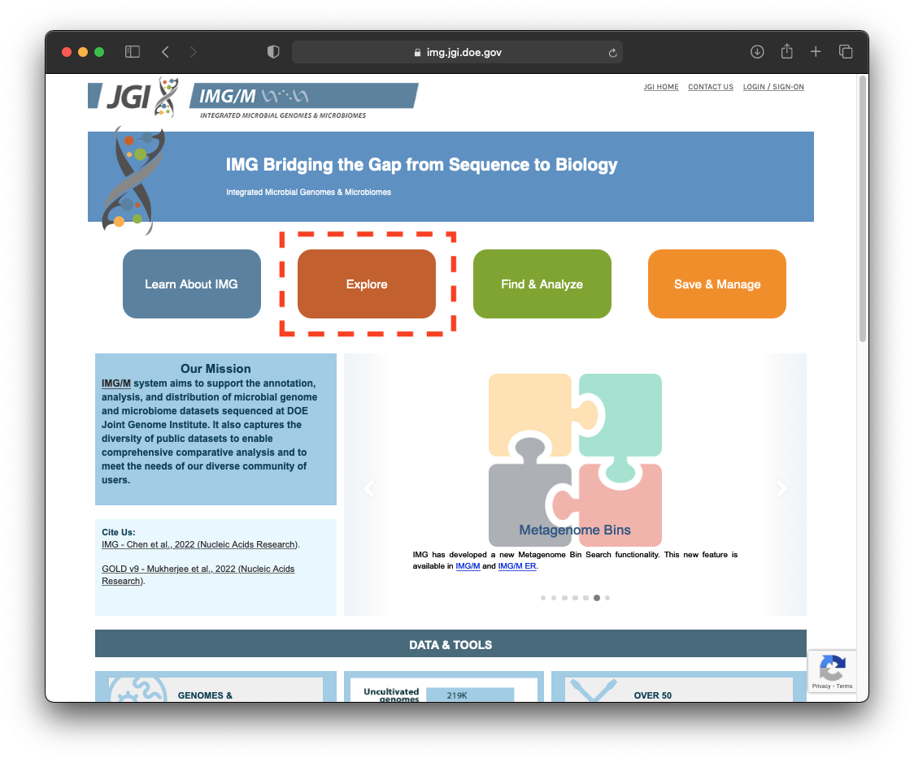
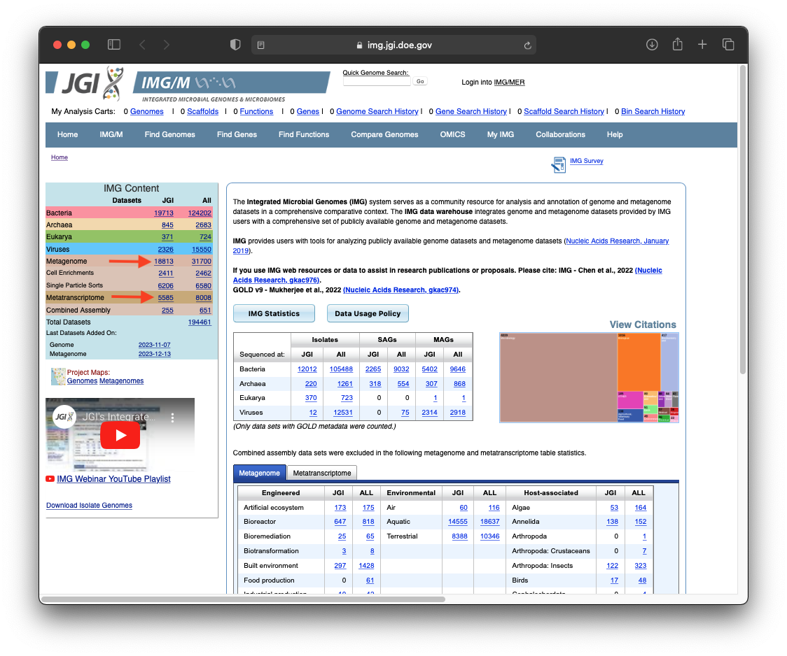
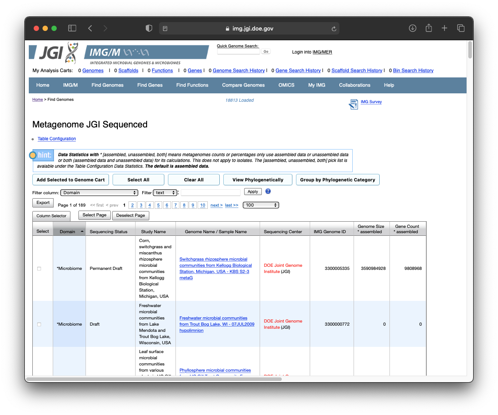
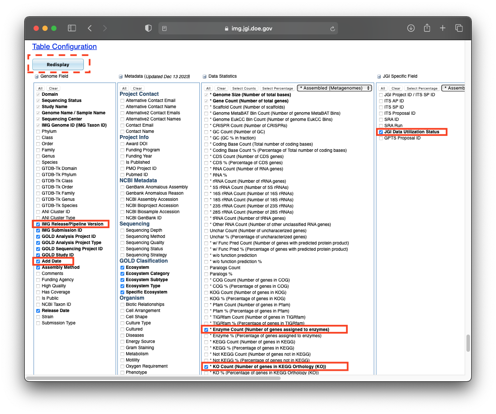
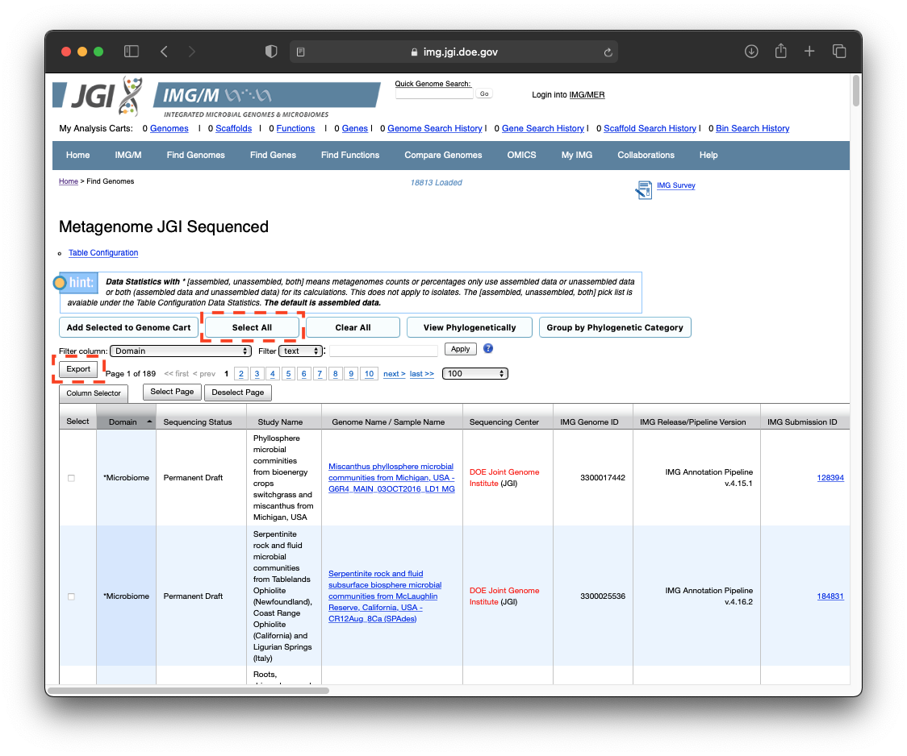

# Downloading Data

## From JGI

First think about what data you're trying to get from JGI. 

Do you need to update a dataset you've already got? Or do you just need a few taxons? Do you know what a taxon is? Do you want genomes or metagenomes? Which domain? Do you want an entirely new pull of the dataset? What meta data do you need. 

### Download a metadata file from IMG/M

### Updating entire databases:

1. Navigate to https://img.jgi.doe.gov/cgi-bin/m/main.cgi on your browser.

2. Select the appropriate database (notice if you want "all" or "JGI" where "JGI" refers to data which been sequenced using JGI's pipeline, and "all" could have been sequenced in many ways).

3. Scroll to the bottom of the page and select the metadata ("Fields") you'd like to include -- this will be project specific and based on your interests/questions.
    - You'll certainly need the following:
        - KO count (not percent)
        - Enzyme count (not percent)
        - IMG Release/Pipeline Version
        - JGI Data Utilization Status
        - Add Date

4. Press `Redisplay`, it'll load a table. You can apply some filtering to this here (see `Filter column`) or filter later using your own scripts later, the later is probably easiest.

5. Press `Select All`, and then `Export`. This will download a file ("exportData.txt").

6. Copy this file to a good spot on your machine and rename it something expressive and informative. Continue to Section `Download Taxon Data`.

### Selecting a small list of Taxons

1. 

2. 